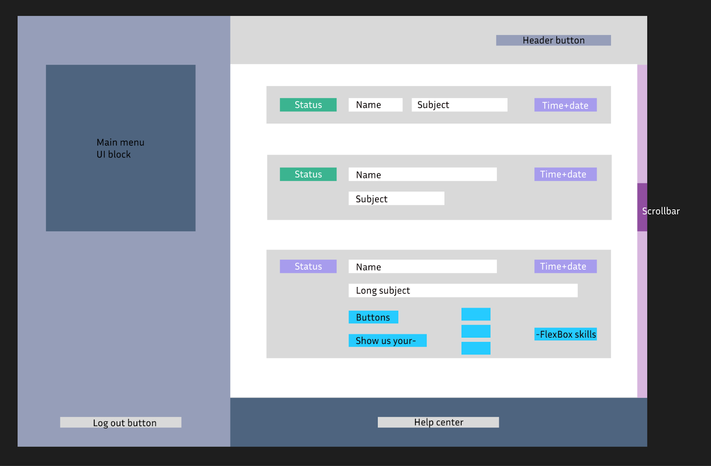

# Test task (React + TS + RTK + Thunk)

Challenge goal:

- Create a page that has a menu on the left, footer, and main cards list.
  Roughly, layout should look as follows.
  
- All texts, buttons and visual UI blocks should be nicely centered. Margins and paddings should be uniform and live in harmony with each other.
  Pick some particular values and use common sense (and simplified mockups from this document) as your guides.
- The page should be built using React and Typescript. CreateReactApp can be used, but is not a must.
- Use any public API as your data source. Pick any two fields to write into "name" and "subject" places in the mockup. (this project uses [FAKE API](https://fakestoreapi.com/docs))
- Cards can be expanded (like the last one in the mockup) by clicking on them. And then cards can be toggled back into the "shrunk" state by clicking on any text-free place of the expanded card.
- Share your solution in the form of a GitHub (or GitLab, Bitbucket) repo.
- Demo-ready deployment (e.g. GitHub pages).
